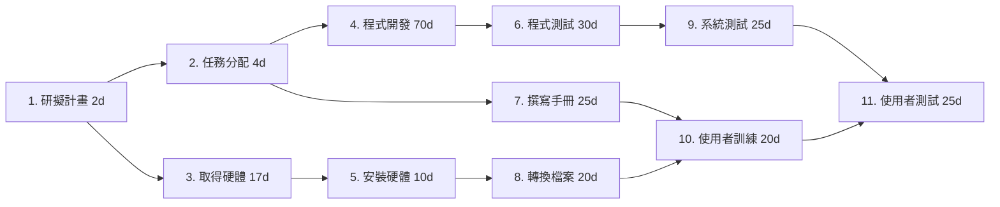
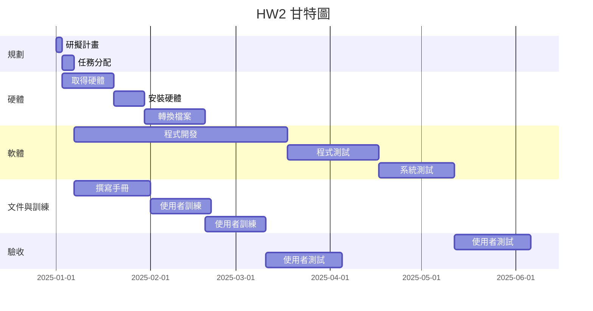

```mermaid
graph LR
  1[1. 研擬計畫 2d] --> 2[2. 任務分配 4d]
  1 --> 3[3. 取得硬體 17d]
  2 --> 4[4. 程式開發 70d]
  3 --> 5[5. 安裝硬體 10d]
  4 --> 6[6. 程式測試 30d]
  2 --> 7[7. 撰寫手冊 25d]
  5 --> 8[8. 轉換檔案 20d]
  6 --> 9[9. 系統測試 25d]
  7 --> 10[10. 使用者訓練 20d]
  8 --> 10
  9 --> 11[11. 使用者測試 25d]
  10 --> 11
```

```mermaid
gantt
    title A Gantt Diagram
    title HW2 甘特圖
    dateFormat  YYYY-MM-DD
    section 規劃
    研擬計畫       :a1, 2025-01-01, 2d
    任務分配       :a2, after a1, 4d
    section 硬體
    取得硬體       :a3, after a1, 17d
    安裝硬體       :a5, after a3, 10d
    轉換檔案       :a8, after a5, 20d
    section 軟體
    程式開發       :a4, after a2, 70d
    程式測試       :a6, after a4, 30d
    系統測試       :a9, after a6, 25d
    section 文件與訓練
    撰寫手冊       :a7, after a2, 25d
    使用者訓練     :a10, after a7, 20d
    使用者訓練     :a10, after a8, 20d
    section 驗收
    使用者測試     :a11, after a9, 25d
    使用者測試     :a11, after a10, 25d
```

```mermaid
graph LR
  1([1. 研擬計畫 2d]) --> 2([2. 任務分配 4d])
  2 --> 4([4. 程式開發 70d])
  4 --> 6([6. 程式測試 30d])
  6 --> 9([9. 系統測試 25d])
  9 --> 11([11. 使用者測試 25d])

  %% 標紅色路徑
  style 1 fill:#ffcccc,stroke:#ff0000,stroke-width:2px;
  style 2 fill:#ffcccc,stroke:#ff0000,stroke-width:2px;
  style 4 fill:#ffcccc,stroke:#ff0000,stroke-width:2px;
  style 6 fill:#ffcccc,stroke:#ff0000,stroke-width:2px;
  style 9 fill:#ffcccc,stroke:#ff0000,stroke-width:2px;
  style 11 fill:#ffcccc,stroke:#ff0000,stroke-width:2px;
```

